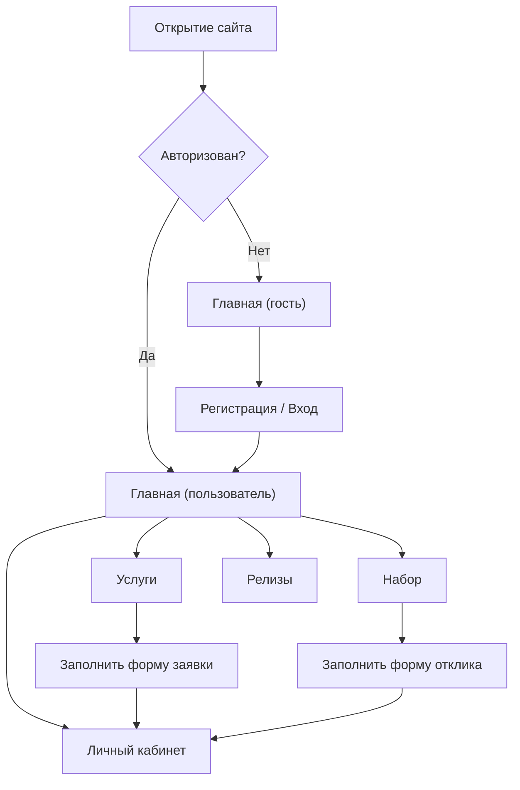

# PRD: Сайт кавер-группы FirePhoenix

## 1. Обзор продукта
FirePhoenix — официальный сайт кавер-группы, объединяющий фанатов и заказчиков. Сайт презентует команду, релизы, услуги адаптации текстов и набор новых участников.
- Целевая аудитория: фанаты группы, потенциальные заказчики, музыканты, желающие присоединиться
- Ценность: единая точка входа для прослушивания релизов, оформления заказов на адаптацию текста и подачи заявки в коллектив

## 2. Ключевые функции

### 2.1 Роли пользователей
| Роль | Способ регистрации | Базовые права |
|------|---------------------|----------------|
| Гость | Без регистрации | Просмотр главной, состава, релизов, услуг, набора |
| Зарегистрированный пользователь | E-mail + пароль | Всё, что у гостя + личный кабинет, избранные релизы, история заявок |
| Администратор | Ручное создание | Управление релизами, составом, заявками (вне MVP) |

### 2.2 Модули функций
1. **Главная**: hero-секция с лого/названием, кратко о группе, последние релизы, CTA на услуги и набор
2. **О группе**: история, стиль, миссия, фотогалерея
3. **Состав**: карточки участников (аватар, имя, роль, мини-профиль, соцсети)
4. **Релизы**: предстоящие и вышедшие (обложка, название, дата, платформы, превью)
5. **Услуги**: адаптация зарубежного текста на русский (что входит, сроки, цена, форма заявки)
6. **Набор**: открытые вакансии (роль, требования, форма отклика)
7. **Авторизация/Регистрация**: вход, регистрация, валидация
8. **Личный кабинет**: профиль, мои заявки, избранные релизы, смена темы

### 2.3 Детали страниц
| Страница | Модуль | Описание функции |
|----------|--------|------------------|
| Главная | Hero | Название группы, слоган, кнопки «Слушать» и «Связаться» |
| Главная | Релизы-превью | 3 последних релиза, ссылка на полный список |
| Главная | Услуги-превью | Карточка услуги адаптации, CTA «Заказать» |
| О группе | История | Текстовый блок с ключевыми вехами |
| О группе | Галерея | Сетка фото (мок-изображения) |
| Состав | Участник | Аватар, имя, роль, био (1-2 предложения), соцсети |
| Релизы | Фильтр | Табы: Все / Скоро / Вышли |
| Релизы | Карточка | Обложка, название, исполнитель оригинала, дата, площадки |
| Услуги | Описание | Что входит в адаптацию, формат работы |
| Услуги | Форма | Имя, контакт, ссылка на трек, комментарий |
| Набор | Вакансия | Роль, требования, условия |
| Набор | Форма | Имя, возраст, опыт, ссылка на портфолио |
| Авторизация | Форма | E-mail, пароль, кнопка входа, ссылка на регистрацию |
| Регистрация | Форма | Имя, e-mail, пароль, подтверждение пароля |
| ЛК | Профиль | Имя, e-mail, аватар, переключатель темы |
| ЛК | Заявки | Список поданных заявок (мок-данные) |

## 3. Ключевые процессы

### 3.1 Регистрация и вход
Гость открывает сайт → нажимает «Войти» → переходит на страницу входа → нажимает «Регистрация» → заполняет форму (имя, e-mail, пароль) → отправляет → попадает в ЛК.

### 3.2 Подача заявки на адаптацию
Гость/пользователь заходит в «Услуги» → изучает описание → заполняет форму → отправляет → видит подтверждение → заявка появляется в ЛК.

### 3.3 Подача заявки на вступление
Аналогично: «Набор» → выбор вакансии → форма → подтверждение → заявка в ЛК.

## 4. Дизайн интерфейса

### 4.1 Стиль дизайна
- **Эстетика**: editorial / музыкальный журнал, но с тёплыми огненными акцентами; баланс между дерзостью и читаемостью
- **Основные цвета** (из палитры пользователя): F77189, F84B6B, D03955 (красно-розовые акценты), F78376, F84E4B, DE3D3B (оранжево-красные переходы), F9B17F, FF9D4D, F7882E (оранжевые блики), FAED9A, FFEB66, FAE143 (жёлтые подсветки)
- **Тёмная тема**: глубокий угольный фон (#0E0B0F), основной текст светлый, акценты — красно-оранжевые градиенты
- **Светлая тема**: кремовый/тёплый белый фон (#FAF5EE), основной текст тёмный, акценты те же
- **Шрифты**: Podarok — для крупных заголовков (характерный «рукописный» кириллический); Coolvetica — для подзаголовков, навигации и UI
- **Кнопки**: rounded-2xl, лёгкий внутренний градиент, мягкая тень, hover-увеличение и смещение тени
- **Иконки**: lucide-react
- **Сетка**: 12-колоночная, max-width 1280px, асимметричные блоки в hero

### 4.2 Обзор дизайна страниц
| Страница | Модуль | UI-элементы |
|----------|--------|-------------|
| Главная | Hero | Полноэкранный блок, гигантский заголовок Podarok, анимированный огненный градиент-фон, навигация-плавашка |
| Главная | Последние релизы | Карточки с обложкой, название шрифтом Podarok, год — Coolvetica |
| О группе | История | 2 колонки: текст + фото, разделитель — декоративная линия-градиент |
| Состав | Участник | Карточка 280×360, аватар-круг с обводкой градиентом, имя Podarok, роль Coolvetica uppercase |
| Релизы | Табы | Sticky-табы сверху, активный таб подчёркнут градиентом |
| Релизы | Карточка | Hover-подъём, появляющаяся плашка «Слушать» |
| Услуги | Описание | Левая колонка — текст, правая — форма на «липкой» карточке |
| Набор | Вакансия | Аккордеон с раскрытием требований |
| ЛК | Карточки | Сетка 2×2: профиль, заявки, избранное, настройки темы |

### 4.3 Адаптивность
- Desktop-first (1280 / 1024 / 768 / 375)
- На мобильных: hero во всю высоту, навигация превращается в гамбургер, состав — вертикальный список

### 4.4 Motion
- Анимация появления страниц: stagger fade-up
- Hero: лёгкое «дыхание» градиента (CSS-keyframes)
- Кнопки: hover — подъём + усиление тени
- Переключение темы — плавный transition 400ms на background и color
