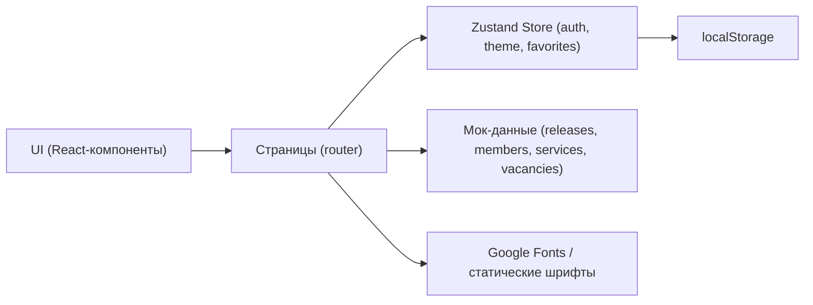

# Техническая архитектура: FirePhoenix

## 1. Архитектура решения
Фронтенд-приложение на React + Vite + TypeScript. Бэкенд не используется — данные берутся из локальных мок-объектов, авторизация сохраняется в `localStorage`. Это позволит быстро развернуть и продемонстрировать MVP, при этом структура кода готова к подключению реального API.



## 2. Стек технологий
- **Frontend**: React@18 + TypeScript + Vite
- **Стилизация**: Tailwind CSS@3 (utility-first) + кастомные CSS-переменные для тем
- **Роутинг**: react-router-dom@6
- **State**: zustand (auth, theme, favorites, user submissions)
- **Иконки**: lucide-react
- **Шрифты**: Podarok (заголовки), Coolvetica (UI). Подключение через Google Fonts (Coolvetica) и локальный woff2 (Podarok) при наличии; fallback на стек с поддержкой кириллицы
- **Инициализация**: vite-init с шаблоном `react-ts`
- **Бэкенд**: отсутствует (mock-данные)
- **БД**: отсутствует (localStorage)

## 3. Маршруты
| Маршрут | Назначение |
|---------|-----------|
| `/` | Главная — hero, превью релизов, превью услуг |
| `/about` | О группе — история, миссия, галерея |
| `/team` | Состав — карточки участников |
| `/releases` | Релизы — табы Скоро / Вышли |
| `/services` | Услуги — адаптация текста, форма заявки |
| `/join` | Набор — открытые вакансии, форма отклика |
| `/login` | Вход |
| `/register` | Регистрация |
| `/profile` | Личный кабинет (защищённый) |
| `*` | 404 — стилизованная страница |

## 4. Структура каталогов
```
src/
├── components/         # UI-компоненты (Button, Card, Navbar, Footer, ThemeToggle, Avatar, Hero, MemberCard, ReleaseCard, ServiceCard, FormField)
├── pages/              # Страницы (Home, About, Team, Releases, Services, Join, Login, Register, Profile, NotFound)
├── layouts/            # RootLayout (навигация, футер, переключатель темы)
├── store/              # Zustand: useAuthStore, useThemeStore, useFavoritesStore, useSubmissionsStore
├── data/               # Мок-данные: members.ts, releases.ts, services.ts, vacancies.ts
├── hooks/              # useDocumentTitle, useScrollReveal
├── utils/              # formatters, validators
├── types/              # TypeScript-типы
├── styles/             # globals.css с CSS-переменными тем
├── App.tsx
└── main.tsx
```

## 5. Цветовые токены
CSS-переменные `:root` (светлая) и `[data-theme="dark"]`:

| Токен | Светлая | Тёмная |
|-------|---------|--------|
| `--bg-base` | #FAF5EE | #0E0B0F |
| `--bg-elevated` | #FFFFFF | #1A1518 |
| `--text-primary` | #1A1518 | #FAF5EE |
| `--text-muted` | #6B5A55 | #B5A8A2 |
| `--accent-primary` | #D03955 | #F84B6B |
| `--accent-warm` | #F7882E | #FF9D4D |
| `--accent-yellow` | #FAE143 | #FFEB66 |
| `--border-soft` | rgba(208,57,85,0.18) | rgba(247,131,118,0.22) |
| `--gradient-fire` | linear-gradient(135deg, #F77189 0%, #F84E4B 40%, #F7882E 100%) | linear-gradient(135deg, #F84B6B 0%, #DE3D3B 50%, #F7882E 100%) |

## 6. Модель данных (mock)
```ts
// types/index.ts
export interface Member {
  id: string;
  name: string;
  role: string;
  bio: string;
  avatar: string;        // URL мок-аватара (используем pravatar/lorem-picsum)
  socials: { vk?: string; telegram?: string; instagram?: string; };
}

export interface Release {
  id: string;
  title: string;
  originalArtist: string;
  cover: string;
  releaseDate: string;   // ISO
  status: 'upcoming' | 'released';
  platforms: { spotify?: string; youtube?: string; yandex?: string; apple?: string; };
  description: string;
}

export interface Service {
  id: string;
  title: string;
  description: string;
  includes: string[];
  price: string;
  turnaround: string;
}

export interface Vacancy {
  id: string;
  role: string;
  requirements: string[];
  conditions: string;
  isOpen: boolean;
}

export interface User {
  id: string;
  name: string;
  email: string;
  avatar?: string;
  registeredAt: string;
}

export interface Submission {
  id: string;
  userId: string;
  type: 'service' | 'join';
  payload: Record<string, string>;
  createdAt: string;
}
```

## 7. Хранилище (Zustand)

### `useAuthStore`
- `user: User | null`
- `login(email, password): boolean` — проверяет наличие в localStorage
- `register(name, email, password): boolean`
- `logout()`
- `updateProfile(patch)`
- Persist через `zustand/middleware/persist`

### `useThemeStore`
- `theme: 'light' | 'dark'`
- `toggle()`
- Применяется к `document.documentElement.dataset.theme`
- Persist

### `useFavoritesStore`
- `favorites: string[]` (id релизов)
- `toggle(id)`, `has(id)`
- Persist

### `useSubmissionsStore`
- `submissions: Submission[]`
- `add(submission)`
- Persist

## 8. Валидация форм
- Email: regex `/^[^\s@]+@[^\s@]+\.[^\s@]+$/`
- Пароль: мин. 6 символов
- Обязательные поля подсвечиваются красной рамкой (accent-primary)
- Сообщения об ошибке под полем

## 9. Адаптивность
- Брейкпоинты Tailwind: sm 640, md 768, lg 1024, xl 1280
- Контейнеры: `max-w-7xl mx-auto px-4 sm:px-6 lg:px-8`
- На мобильных: гамбургер-меню, вертикальные карточки

## 10. Сборка и запуск
- `npm install`
- `npm run dev` — запуск Vite dev-сервера
- `npm run build` — продакшн-сборка
- `npm run preview` — локальный просмотр прода
